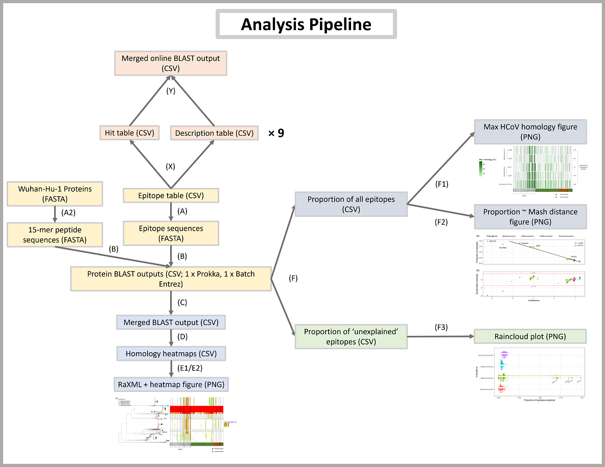

# Pre-existing T cell-mediated cross-reactivity to SARS-CoV-2 cannot solely be explained by prior exposure to endemic human coronaviruses
**DOI:** TBC \
**Authors:** Cedric C.S. Tan*, Christopher J. Owen, Christine Y.L. Tham, Antonio Bertoletti, Lucy van Dorp&, Francois Balloux& (* corresponding author; & co-lead authors) \
\
This repository contains all source code for the analyses performed and the results in the associated manuscript. \
\
 \
\
**Links to scripts** \
[**(A)**](utils/A_parse_csv_epitopes_to_fasta.R) 
[**(A2)**](utils/A2_make_fasta_out_of_proteins.R) 
[**(B)**](B_blast_epitopes.sh) 
[**(C)**](C_parse_merge_blastout.R) 
[**(D)**](D_blastout_to_heatmap.R) 
[**(E1)**](E1_raxml_tree_heatmap.R) 
[**(E2)**](E2_raxml_tree_heatmap_deconvoluted_epitopes.R) 
[**(F)**](F_F1_analyse_deconvoluted_epitopes.R) 
[**(F1)**](F_F1_analyse_deconvoluted_epitopes.R) 
[**(F2)**](F2_mash_prop_regression.R) 
[**(F3)**](F3_deconvoluted_proportion_of_unexplained_hits.R) 
[**(X)**](https://tinyurl.com/y6eee5ap) 
[**(Y)**](utils/Y_merge_web_blast.R) \
\
Direct any queries to me! (cedriccstan@gmail.com)
