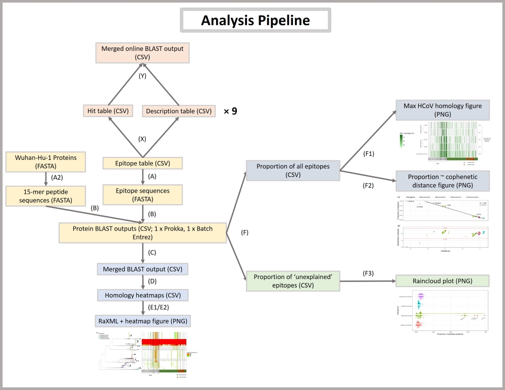

# Pre-existing T cell-mediated cross-reactivity to SARS-CoV-2 cannot solely be explained by prior exposure to endemic human coronaviruses
**DOI:** TBC \
**Authors:** Cedric C.S. Tan*, Christopher J. Owen, Christine Y.L. Tham, Antonio Bertoletti, Lucy van Dorp&, Francois Balloux& (* corresponding author; & co-lead authors) \
This repository contains all source code for the analyses performed and the results in the associated manuscript. \
\
 \
\
**Scripts**
[**(A)**](utils/parse_csv_epitopes_to_fasta.R)

